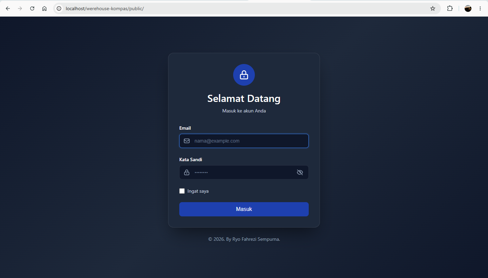
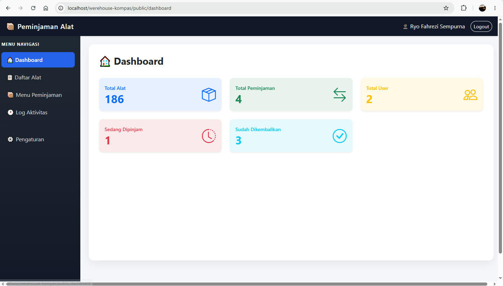
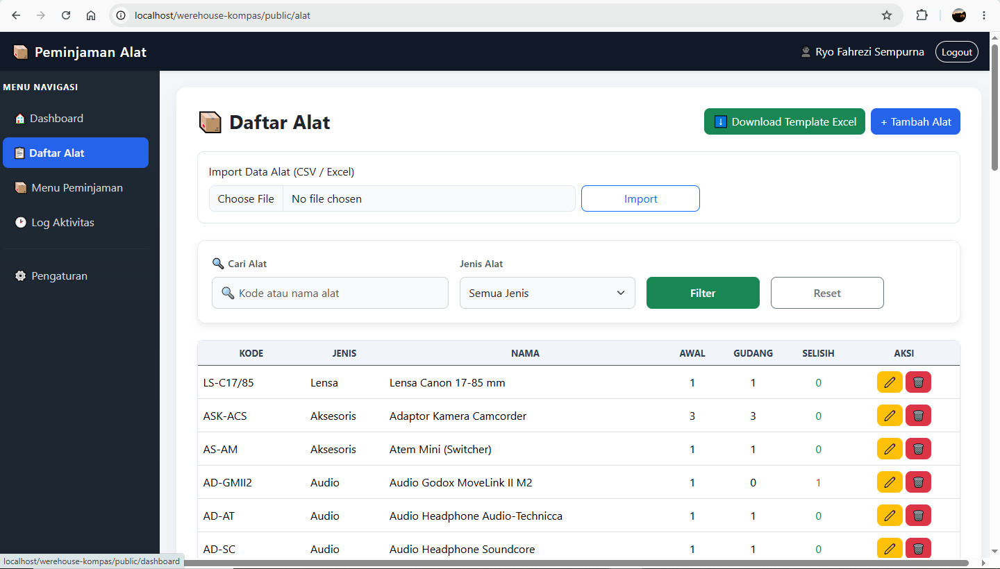
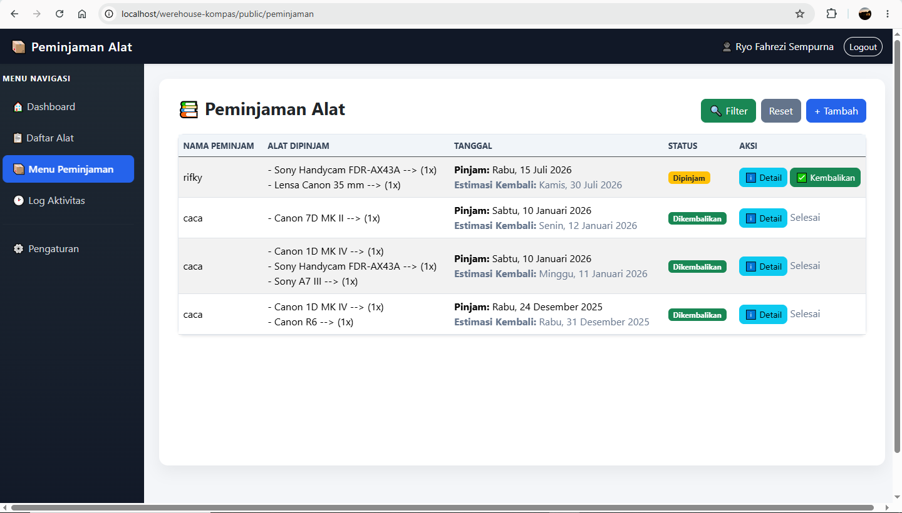

# 📦 Werehouse-Kompas

A web-based warehouse and equipment loan management system built with Laravel. This application helps organizations manage equipment inventory, borrowing, returns, and reporting efficiently through a simple and user-friendly interface.

---

## ✨ Features

### Equipment Management

* Add, edit, and delete equipment data
* Equipment category management
* Equipment availability tracking
* Search and filter equipment

### Borrowing Management

* Create equipment borrowing requests
* Record borrower information
* Borrowing status management
* Due date management

### Return Management

* Record returned equipment
* Track actual return dates
* Update equipment availability automatically

### Reports

* Filter reports by date
* Export reports to Excel (.xlsx)
* Export reports to CSV
* Printable report support

### Dashboard

* Overview of equipment statistics
* Active borrowings
* Returned equipment
* Equipment availability summary

---

## 🛠️ Tech Stack

| Category                | Technology         |
| ----------------------- | ------------------ |
| Backend                 | Laravel            |
| Language                | PHP                |
| Database                | MySQL              |
| Frontend                | Blade              |
| Styling                 | Bootstrap 5        |
| JavaScript              | JavaScript, jQuery |
| Development Environment | Laragon            |
| Package Manager         | Composer, NPM      |

---

## 📸 Screenshots

## Login Page



## Dashboard



## Product Management



## Cashier



---

## 📂 Project Structure

```
app/
bootstrap/
config/
database/
public/
resources/
routes/
storage/
```

---

## 🚀 Installation

### 1. Clone the repository

```bash
git clone https://github.com/yourusername/werehouse-kompas.git
```

### 2. Open the project

```bash
cd werehouse-kompas
```

### 3. Install dependencies

```bash
composer install
npm install
```

### 4. Copy environment file

```bash
cp .env.example .env
```

### 5. Generate application key

```bash
php artisan key:generate
```

### 6. Configure database

Edit the `.env` file.

```env
DB_CONNECTION=mysql
DB_HOST=127.0.0.1
DB_PORT=3306
DB_DATABASE=your_database
DB_USERNAME=root
DB_PASSWORD=
```

### 7. Run migrations

```bash
php artisan migrate
```

### 8. Build frontend assets

```bash
npm run build
```

### 9. Start the application

Using Laragon, simply start Apache and MySQL, then open:

```
http://localhost/werehouse-kompas/public
```

---

## 📊 Export Features

The application supports exporting reports in:

* Microsoft Excel (.xlsx)
* CSV (.csv)

Reports can be filtered using:

* Borrow Date
* Due Date
* Actual Return Date

---

## 📁 License

This project is intended for educational and portfolio purposes.

---

## 👨‍💻 Author

**Ryo Fahrezi**

* Laravel Developer
* PHP Developer
* Web Application Developer

If you find this project helpful, feel free to give it a ⭐ on GitHub.
